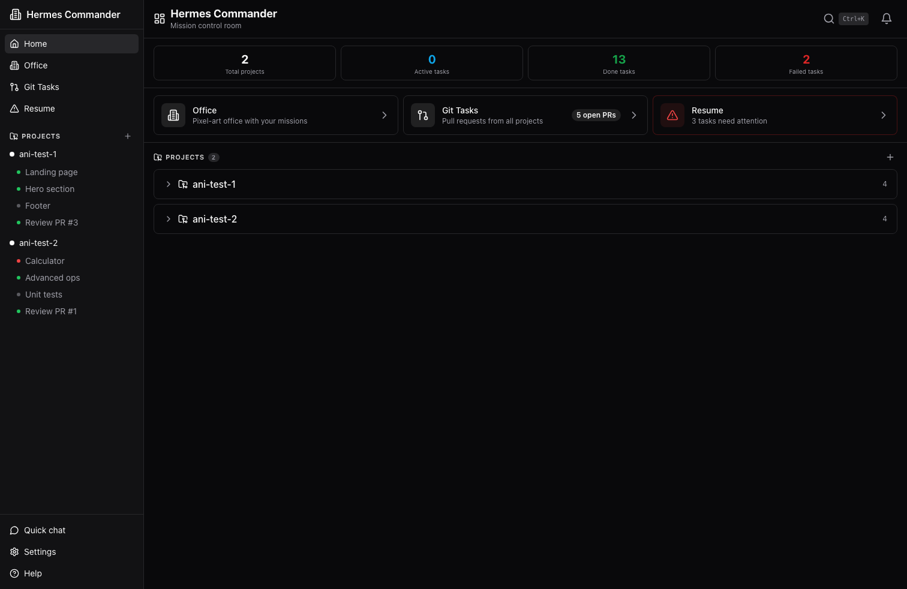
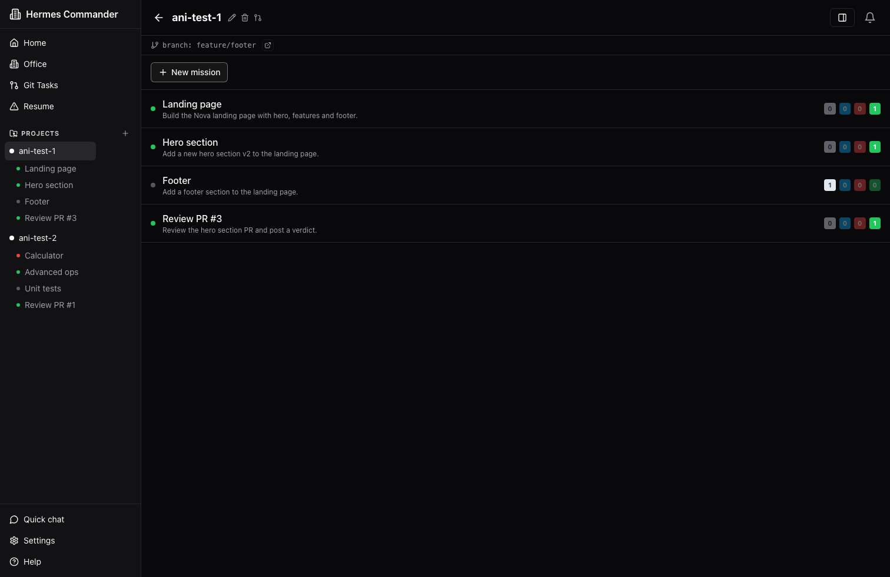
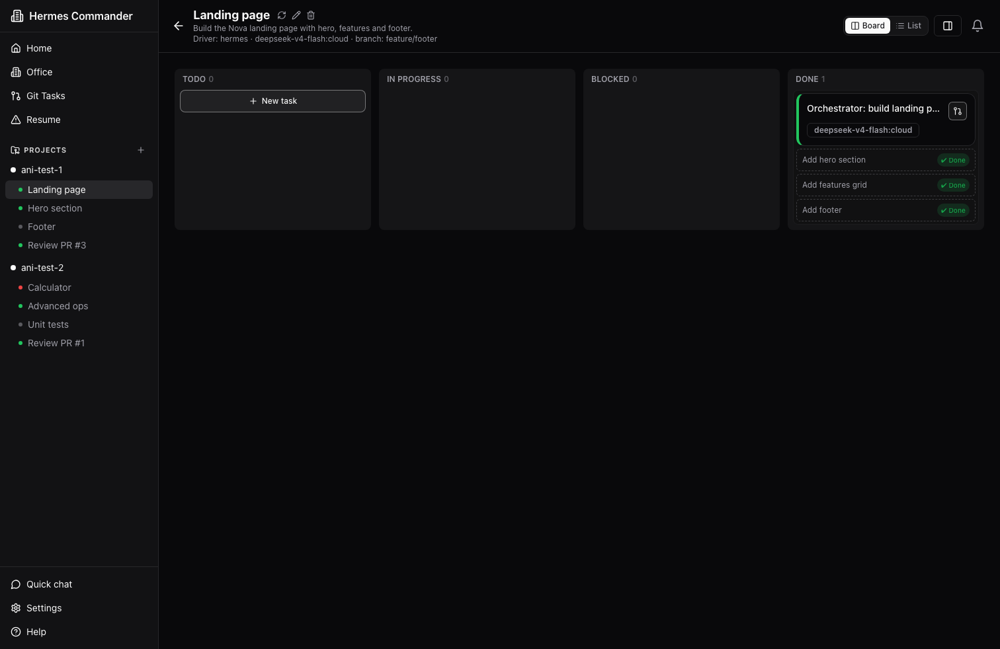
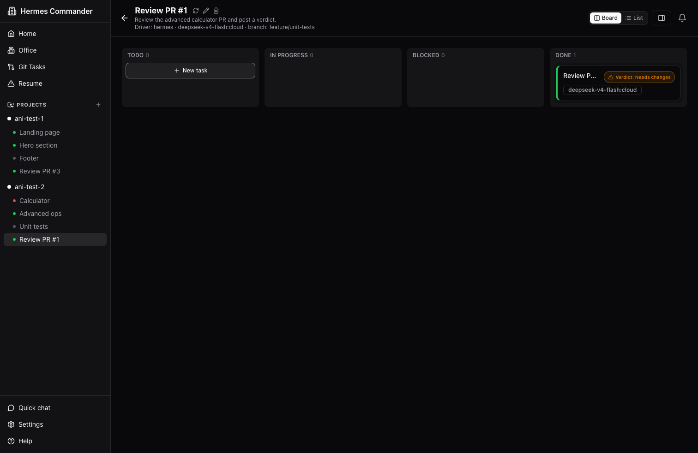
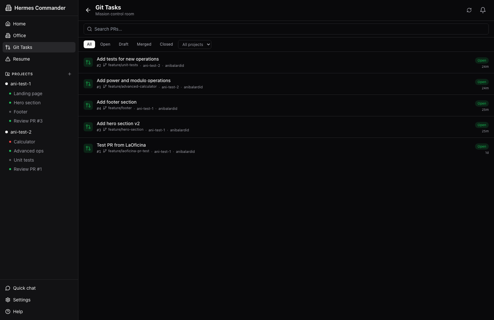
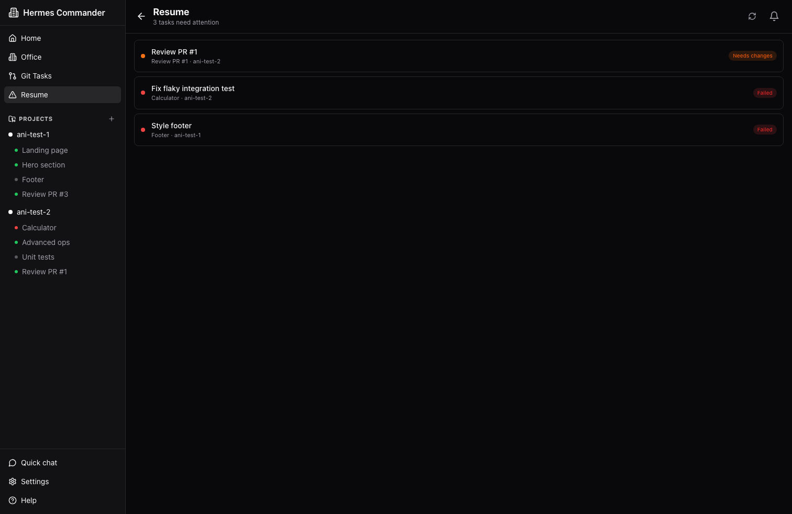
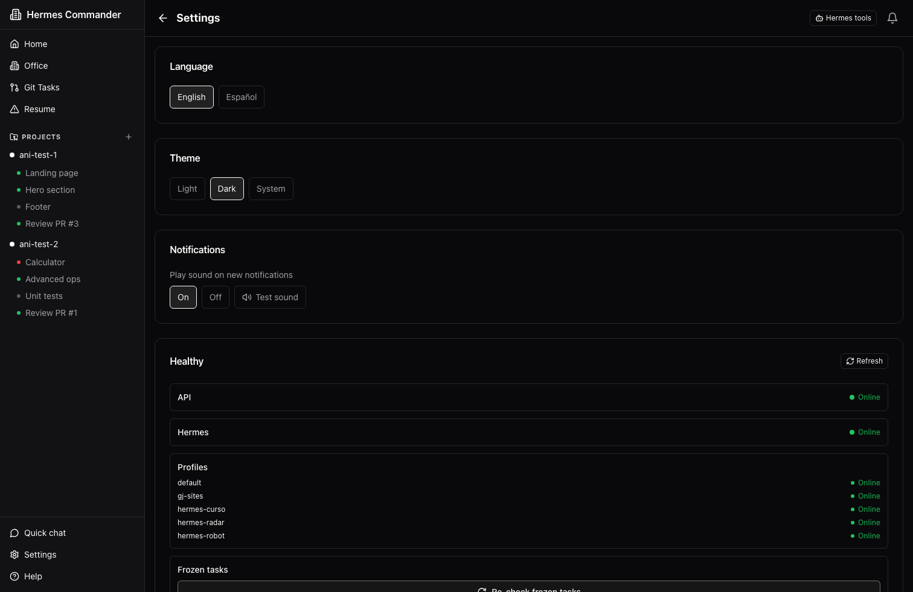
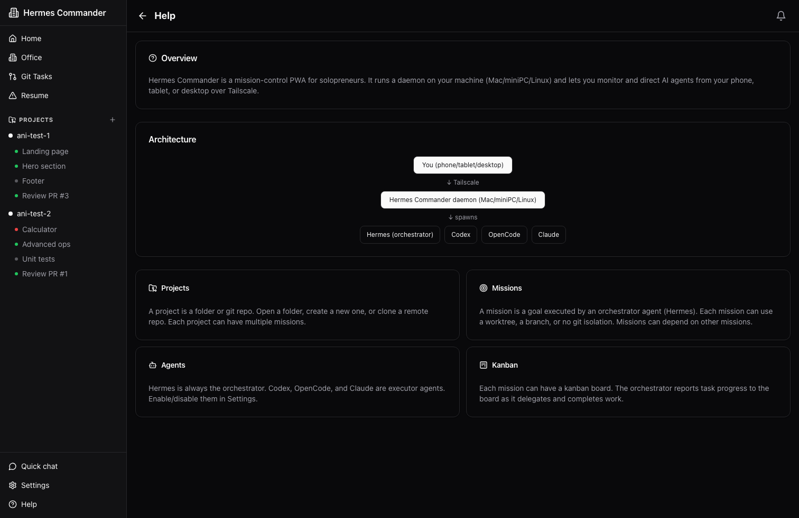

# Hermes Commander

> **Command your agents. Ship your work.**
>
> Mission Control for startups and solopreneurs. Manage projects, missions and AI agents
> (Hermes as orchestrator) from your phone, tablet or desktop, over Tailscale.
> 100% web, single-user.

## Concept

Hermes Commander is a unification layer over open-source tools that already solve each
part of the problem:

| Piece | Tool | Role |
|-------|------|------|
| Multi-agent orchestrator | **Hermes** | Plans, delegates to subagents, iterates, reports |
| Specialized executors | **Codex / OpenCode / Claude** | Point tasks via delegate_task |
| Isolated worktrees | **git worktree** | Each mission runs in its own repo copy |
| Task board | **Hermes Commander kanban (own)** | Mission & subagent status — built 100% in this project |
| Secure network | **Tailscale** | Remote mobile access |

Hermes Commander does **not** rewrite orchestration: **Hermes is always the
orchestrator**, and Hermes Commander is the web daemon (front + back) living on your
host (Mac/miniPC/linux) that exposes the "mission control room" to your phone.

## Stack

- **Monorepo** TypeScript (`npm workspaces`)
- **Backend**: Fastify + WebSocket + SQLite (`better-sqlite3`)
- **Frontend**: React PWA (Vite), **shadcn-style** UI kit with dark/light mode
- **i18n**: English + Spanish UI strings (code & docs always in English)
- **Agent execution**: spawn `hermes` process per mission (profile/model/provider/worktree via flags)
- **Network**: REST + WebSocket, exposed over Tailscale

## Requirements

Validated by `./install.sh` (see `docs/10-scripts.md`). The scripts themselves
only need **bash** (3.2+ on macOS, 4+ on Linux).

| Requirement | Type | Notes |
|-------------|------|-------|
| `node` (>=20) | required | `engines.node` in `package.json` |
| `npm` | required | bundled with node (manual install) |
| `python3` | required | PTY helper for the embedded terminal |
| `git` | required | worktrees, clone, source control |
| `gh` | optional | only for creating PRs |
| `hermes` | required | orchestrator + TUI terminal (manual install) |
| `tailscale` | optional | remote access from your phone |

## Quick Start

```bash
# 1. Validate & install host requirements (node, git, hermes, ...)
./install.sh

# 2. Start the services (database → API :4310 → frontend :5173)
./start.sh

# 3. Stop the services when done
./stop.sh
```

- `./install.sh --dry-run` prints the install commands without running them.
- `./stop.sh -y` stops everything without asking (non-interactive).
- `./reset-db.sh` wipes the database and re-initializes it from scratch
  (asks for confirmation twice — yes/no, then typing today's date).
- `./test.sh` configures a throwaway test DB and runs the test suite.
- The database is created/migrated automatically by the API on first start
  (no separate setup step needed).

## Documentation

- `docs/00-vision.md` — vision & scope
- `docs/01-architecture.md` — components & flow
- `docs/02-data-model.md` — Project / Mission / Task (+ telemetry/logs)
- `docs/03-mission-runtime.md` — per-mission Hermes spawn
- `docs/04-frontend.md` — UI + i18n
- `docs/05-api.md` — REST + WebSocket contract
- `docs/07-decisions.md` — resolved decisions & remaining open questions
- `docs/08-workspace-panel.md` — the right-side workspace panel (source/files/logs)
- `docs/09-tui-terminal.md` — embedded Hermes TUI terminal tab + prerequisites
- `docs/10-scripts.md` — shell scripts (install/start/stop/test) + confirmations

## Screenshots

> Dark mode, English UI, captured at 1512×982.

| | |
|---|---|
| **Home** — mission control overview with stats and quick access | **Project detail** — missions grouped by project |
|  |  |
| **Mission board** — kanban with tasks and subtasks | **Mission board (review)** — PR review with verdict |
|  |  |
| **Git Tasks** — pull requests across all projects | **Resume** — tasks that need attention |
|  |  |
| **Settings** — language, theme, notifications, health | **Help** — overview and architecture |
|  |  |
