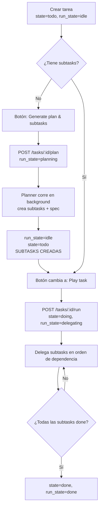
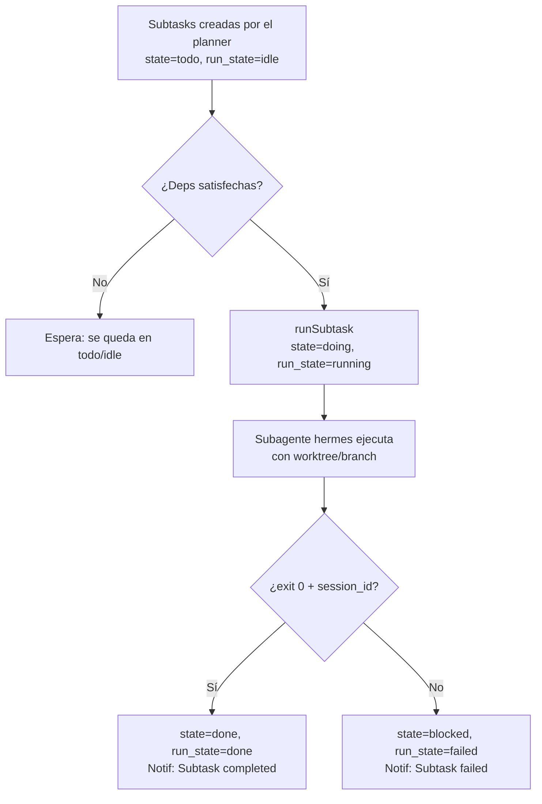
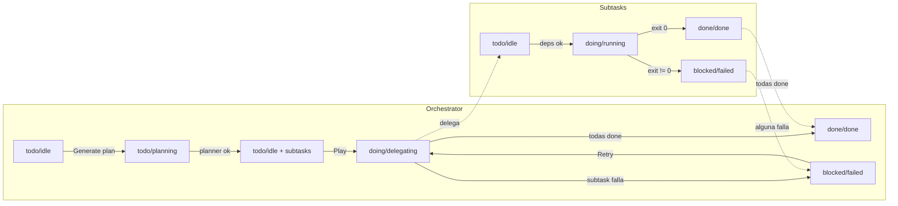

# Hermes Commander — Flujo de Estados de Tareas

> Documento de referencia del ciclo de vida completo de una tarea: desde su
> creación hasta que termina (o falla), incluyendo subtareas, botones, badges,
> estados y notificaciones. Código 100% en inglés; este doc en español.

---

## 1. Modelo de estados

Cada tarea tiene **dos** campos de estado que evolucionan en paralelo:

| Campo | Valores | Qué significa |
|-------|---------|---------------|
| `state` | `todo` · `doing` · `blocked` · `done` | Estado **lógico** (kanban): qué fase está. |
| `run_state` | `idle` · `planning` · `delegating` · `running` · `waiting` · `waiting_review` · `waiting_user` · `paused` · `failed` · `done` | Sub-estado de **ejecución**: qué está haciendo el agente ahora. |

**Regla de oro:** `state` es lo que se ve en el kanban (columna); `run_state`
es el badge de ejecución. Un orchestrator (tarea padre) y sus subtasks tienen
estados **independientes** — el padre delega, las subtasks ejecutan.

### Mapa de colores de badges (RunStateBadge)

| run_state | Icono | Color |
|-----------|-------|-------|
| `idle` | Clock | gris (muted) |
| `planning` | Brain | violeta |
| `delegating` | GitBranch | celeste (sky) |
| `running` | Loader2 (gira) | verde |
| `waiting` | Workflow | azul |
| `waiting_review` | Eye | cian |
| `paused` | Pause | amarillo |
| `failed` | XCircle | rojo |
| `waiting_user` | UserX | naranja |
| `done` | CheckCircle2 | verde oscuro |

> **Stale (rojo):** si `alive === false` y el `run_state` es activo
> (planning/delegating/running/waiting/...), el badge se pone rojo y muestra
> "No live process" — significa que la tarea dice estar activa pero no hay
> proceso real detrás (crash / reinicio del server).

---

## 2. Flujo completo de una tarea

### 2.1 Tarea **orchestrator** (padre, sin `parent_id`)



**Puntos clave del orchestrator:**
- **Nunca ejecuta código** — solo planifica y delega.
- Al pulsar **Generate plan**, queda en `todo`/`planning` (NO se mueve a in
  progress). El planner corre en background y crea las subtasks + el spec.
- Cuando el plan termina, vuelve a `todo`/`idle` **con subtasks creadas** → el
  botón cambia de "Generate plan" a **"Play task"**.
- Solo al pulsar **Play** pasa a `doing`/`delegating`.
- Se marca `done` únicamente cuando **todas** sus subtasks están `done`.

### 2.2 Tarea **subtask** (hija, con `parent_id`)



**Puntos clave de la subtask:**
- Se ejecuta como **subagente propio** (`hermes chat`), en su worktree/branch.
- Corre en **paralelo** con otras subtasks independientes (mismo batch de deps).
- Dependencias: una subtask solo arranca cuando sus `depends_on` están `done`.
- Si una subtask falla, el orchestrator se marca `blocked`/`failed` (pero las
  otras subtasks del batch siguen corriendo).

---

## 3. Botones por estado (panel de tarea seleccionada)

| Estado del orchestrator | Botón visible | Acción |
|-------------------------|---------------|--------|
| `todo` + sin subtasks | **Generate plan & subtasks** (violeta) | `POST /plan` → planning |
| `planning` | Spinner (deshabilitado) | — |
| `todo` + con subtasks | **Play task** (verde) | `POST /run` → delegating |
| `doing`/`delegating`/`running` | **Stop** (rojo) | `POST /stop` |
| `blocked`/`failed` | **Retry** (azul/celeste) | re-ejecuta |
| `done` | (sin botón de run) | — |

**Reglas de color (whitelist positiva):**
- **Verde** = Play (acciones de avance).
- **Azul/celeste** = Retry (reintentar tras fallo).
- **Rojo** = SOLO para Stop / Delete / Cancel (acciones destructivas).

**Botón Delete:** solo para tareas top-level (no subtasks). Si la tarea tiene
worktree/branch propio, primero pregunta si borrarlo.

---

## 4. Estados y transiciones detalladas

### 4.1 Orchestrator

```
todo/idle ──(Generate plan)──▶ todo/planning ──(planner ok)──▶ todo/idle (con subtasks)
todo/idle ──(Play)────────────▶ doing/delegating ──(todas subtasks done)──▶ done/done
doing/delegating ──(subtask falla)──▶ blocked/failed
todo/planning ──(planner falla)──▶ blocked/failed
blocked/failed ──(Retry)──────▶ doing/delegating (re-plan + re-delega)
```

### 4.2 Subtask

```
todo/idle ──(deps ok)──▶ doing/running ──(exit 0)──▶ done/done
doing/running ──(exit != 0)──▶ blocked/failed
```

---

## 5. Notificaciones (campana)

| Evento | type | Título | Puntito |
|--------|------|--------|---------|
| Tarea (orchestrator) completada | `task_done` | "Task completed" | 🟢 verde |
| **Subtask** completada | `subtask_done` | "**Subtask** completed" | 🟢 verde |
| Tarea fallida | `task_failed` | "Task failed" | 🔴 rojo |
| **Subtask** fallida | `subtask_failed` | "**Subtask** failed" | 🔴 rojo |
| Misión completada | `mission_done` | "Mission completed" | 🟢 verde |
| Misión fallida | `mission_failed` | "Mission failed" | 🔴 rojo |

> Cada línea de notificación muestra un **puntito de color** a la izquierda del
> título, reflejando el estado: verde = completado, rojo = fallido, azul =
> en ejecución. Las subtasks se distinguen de las tareas en el texto
> ("Subtask" vs "Task").

---

## 6. Watchdog (auto-recuperación)

Cada 30s, el server revisa tareas que dicen estar activas pero no tienen
proceso vivo (crash / reinicio). Reglas:

- **`planning` NO se toca** — es auto-gestionado por `planTaskAsync` (el
  planner corre en background sin proceso propio). Si el watchdog lo tocara,
  auto-ejecutaría la tarea al pulsar "Generate plan" (bug corregido).
- **`delegating`** con subtask activa (`doing`/`running`) → se salta (trabajo
  legítimo).
- **`delegating`** sin subtask activa y con subtasks pendientes → auto-retry.
- **`running`** sin proceso → auto-retry (1 vez) o marca `failed`.
- Un orchestrator en `runningOrchestrators` (ejecutando su loop) → se salta.

---

## 7. Resumen visual del ciclo completo


